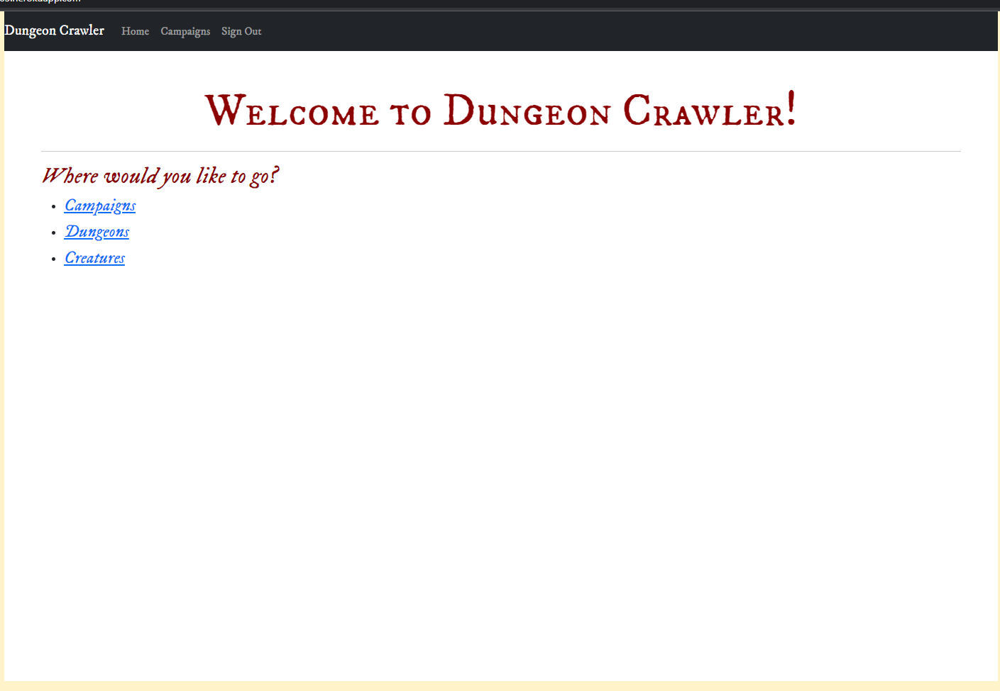
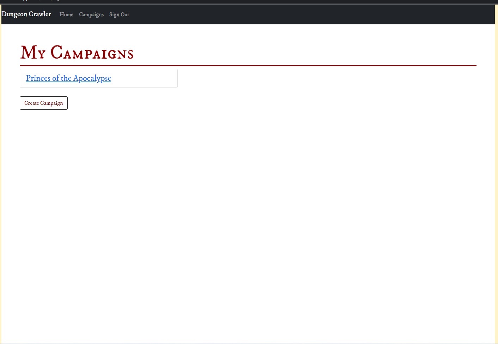
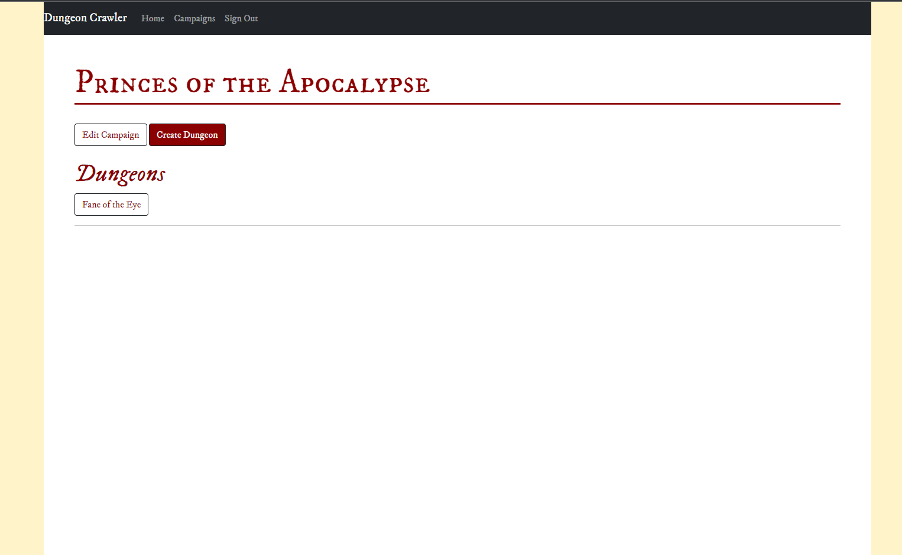
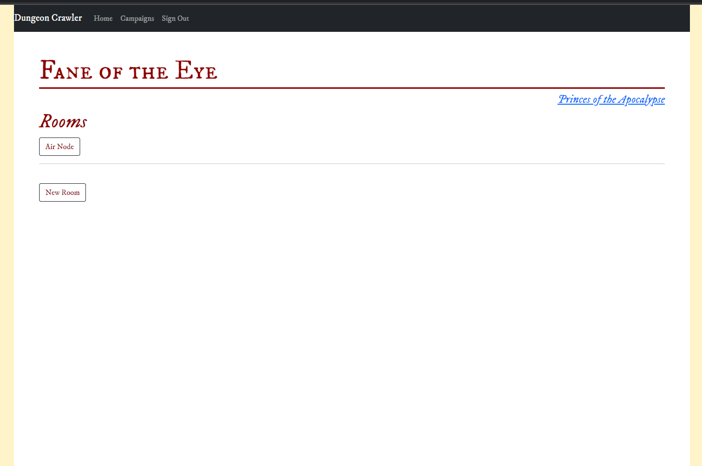
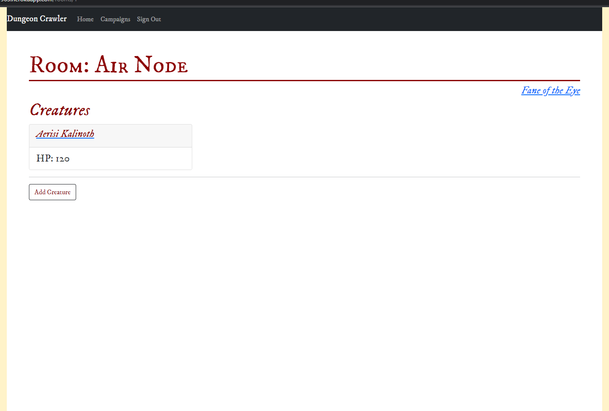
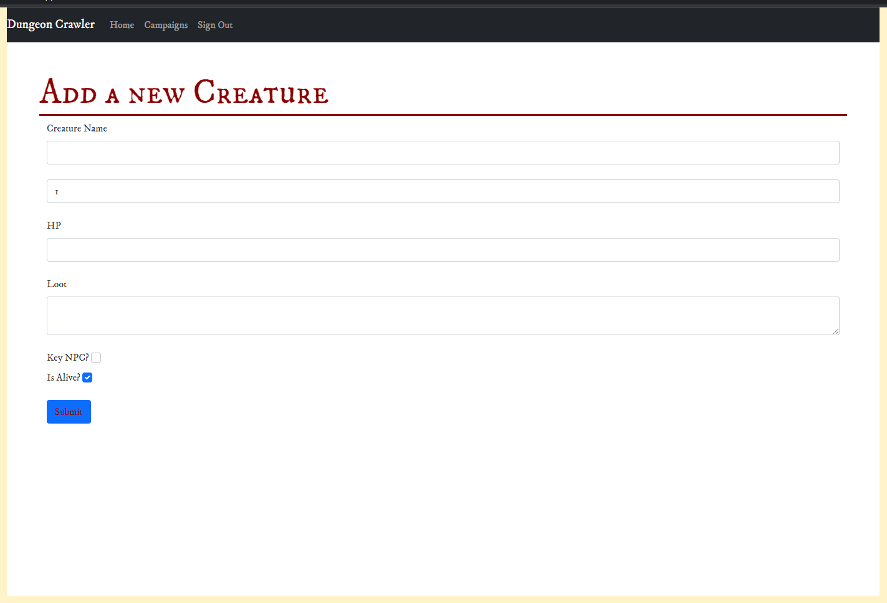

# Dungeon Crawler

 ## Description

_Welcome to your new favorite Dungeons and Dragons application! Dungeon Crawler was created to solve the age-old problem of flipping through your library of D&D books to find all of the information needed to play the game. As a user you are allowed to create a campaign and then add dungeons, rooms, and creatures within that campaign._ 

This application:
* is deployed on [heroku](https://frozen-bayou-97963.herokuapp.com/ "link to deployed app")
* is a _fantastic_ way to save your Campaign information!

---

  ## Table of Contents
  
  - [Usage](#usage)
  - [Installation](#installation)
  - [Gifs](#gifs)
  - [Screenshots](#screenshots)
  - [License](#license)
  - [Technologies](#technologies)
  - [Questions](#questions)

  ---

  ## Usage
Use this how you see fit to save your Dungeons&Dragons information onto the database!

  * Dummy log-in email: test1@test1.com and password: testtest1 
 
 Launch the app on [heroku!](https://frozen-bayou-97963.herokuapp.com/ "link to deployed app") and then either create an account by clicking on the sign up link or login using the dummy login information provided above. Once you are logged in you are able to navigate through the pages to create campaigns, dungeons, rooms, and creatures. Once you have all the information entered about your campaign the next step it to enjoy playing without having to worry about the simple things what creature is in which room because you can update things like that on the fly! 
 

  ---

  ## Installation

This project is currently deployed on Heroku and does not need to be downloaded.

  ---

  ## GIFS

  ---

  ## Screenshots

Here are some screen shots of this application.

    

  ---

  ## License

Copyright (c) [2022] [Ben Martin, Amber Robeck, Kate Neuse]

  
  ---
  
  ## Technologies

   * Node js
   * MySQL
   * Sequelize
   * Express.js
   * bcrypt
   * Heroku
   * Old book Css
   * express-handlebars
   * bootstrap
   

  ---

  ## Questions
  
  Contact us: 

### <u>Via email</u>

[Ben Martin](mailto:bmartin2009@gmail.com)
    
[Amber Robeck](mailto:arr5533@gmail.com)

[Kate Neuse](mailto:kneu4581@gmail.com)

* OR here

### <u>Via GitHub</u>

 [Ben Martin](https://github.com/the-wake)

 [Amber Robeck](https://github.com/Amber-Robeck)
 
 [Kate Neuse](https://github.com/kateneuse)

Made with [contrib.rocks](https://contrib.rocks).
